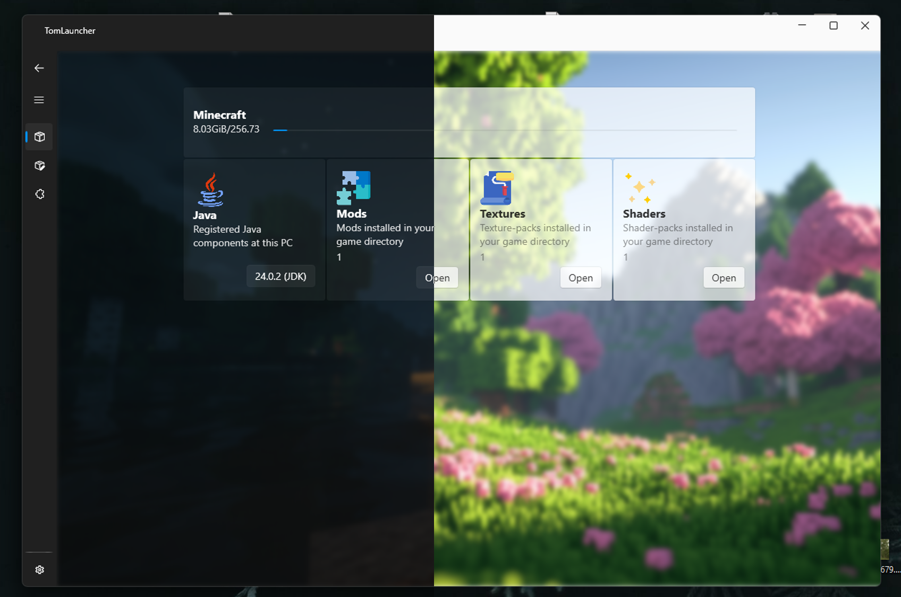

### TomLauncher
Tomlauncher is a hobby project designed using .NET 
and Windows Presentation Framework (WPF). 
This is a modifications scanner and mod-pack manager for Java Minecraft.
On the first stages this is not exactly launcher yet...

### Getting started
For the end-users the instructions set pretty simple:
 - Download archive from `Releases`
 - Unpack
 - Run `TomLauncher.exe`

For the developers too. Forking of this repository
you need to have just configured .NET 8.0.
While solution is opening, following nuget packages will install too.
 - Fork
 - Open `TomLauncher.sln`
 - Wait for nuget dependencies
 - Build (configuration what you want)

### Dependencies
Tomlauncher uses next nuget packages:
 - Tomlyn
 - WPF-UI
 - SharpCompress

Also unfortunately application uses Win32 API that's why 
it can't be cross-platform.

### License
This code licensed under MIT. See `LICENSE` file.